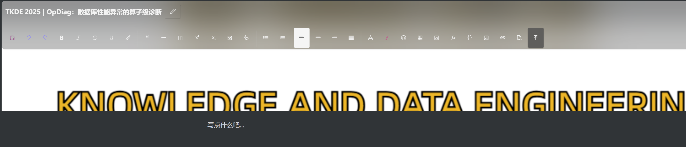
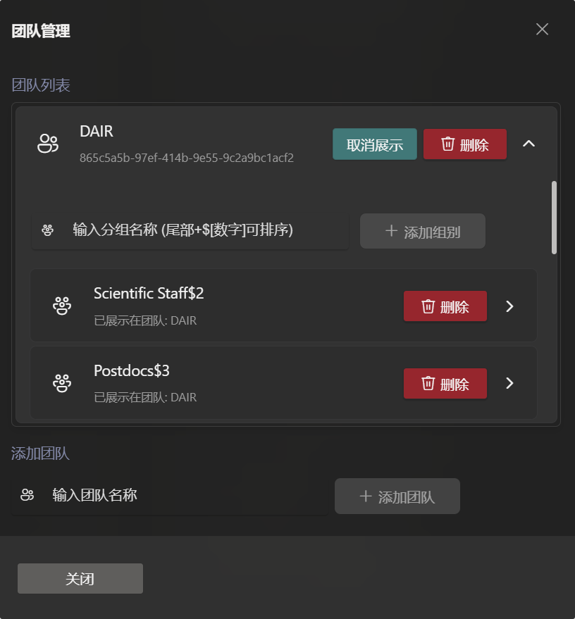
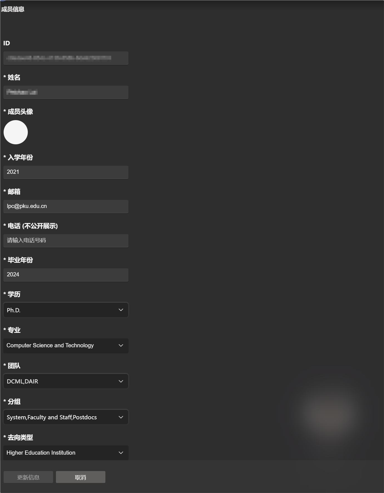
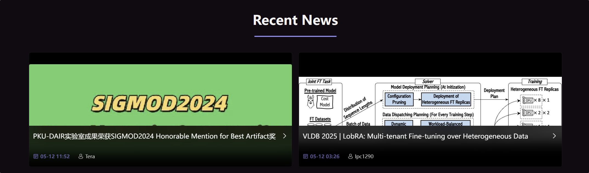
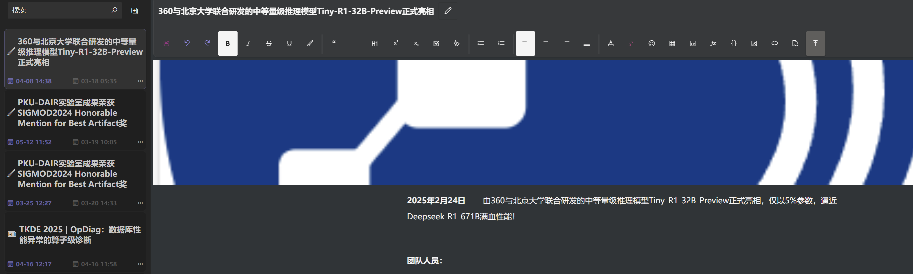
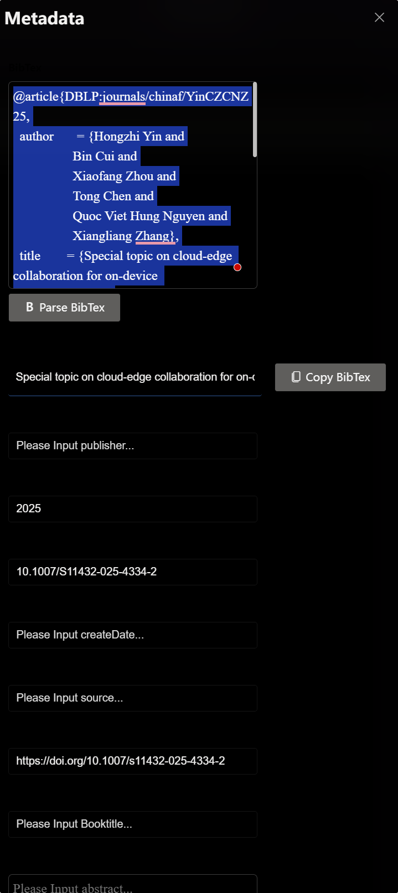

# **PKU-DAIR Frontend**

<p align="center">
    
    <p align="center">
        <a href="https://github.com/PKU-DAIR">
            
        </a>
        <a href="https://github.com/PKU-DAIR/DAIR_Portal_FE">
            
        </a>
        <a href="https://github.com/PKU-DAIR/DAIR_Portal_FE">
            
        </a>
    </p>
</p>

## 🌐 Project Overview

This project is the **frontend of the PKU-DAIR Team Portal Website** (accessible at [pkudair.site](https://pkudair.site)).

The website serves as an integrated portal platform for academic teams, designed to support **presentation, communication, and management**. Its main purposes include:

* Displaying the team’s research directions, scientific achievements, and latest updates;
* Managing and showcasing team members’ profiles and academic resumes;
* Maintaining and updating research projects, publications, and news;
* Providing visualized editing and management tools to enhance usability and scalability.

The project is developed using the **Vue** framework and follows the **Microsoft Fluent Design System**, offering a modern interface and high usability.

---

## 🧱 Tech Stack

| Category        | Technology / Framework                                                   |
| --------------- | ------------------------------------------------------------------------ |
| Frontend        | Vue 2 + Vue Router + Vuex                                                |
| UI Design       | Microsoft Fluent Design + [VFluent](https://github.com/aleversn/VFluent) |
| Language        | TypeScript + JavaScript                                                  |
| Build Tool      | Webpack + Babel                                                          |
| Package Manager | Yarn                                                                     |
| Deployment      | Docker + Nginx                                                           |
| Visualization   | WYSIWYG Editor + Custom Component System                                 |

---

## 📁 Project Structure

```
PKU-DAIR-Frontend/
├── docs/                  # Project documentation and resources
│   └── assets/            # Images and static resources
│
├── nginx/                 # Nginx configuration for Docker deployment
│   └── nginx.conf         # Server routing and static resource setup
│
├── public/                # Static entry files for the Vue app
│
├── src/                   # Source code directory
│   ├── components/        # Common components
│   ├── views/             # Page components
│   ├── router/            # Routing configuration
│   ├── store/             # State management
│   └── assets/            # Local static assets (icons, styles, etc.)
│
├── babel.config.js        # Babel configuration
├── docker-compose.yml     # Docker Compose configuration (port mapping, etc.)
├── Dockerfile             # Docker build file
├── global.d.ts            # Global TypeScript type definitions
├── vue.config.js          # Vue CLI configuration
└── package.json           # Project dependencies and package settings
```

---

## ✨ Key Features

##### 📝 WYSIWYG Visual Editor

<p align="left" width="50">
    
</p>

##### 👥 Team Member & Organization Management

<p align="left" width="50">
    
</p>

##### 🧑‍💼 Personal CV Management and Updates

<p align="left" width="50">
    
</p>

##### 📰 News & Project Management

<p align="left" width="50">
    
</p>

<p align="left" width="50">
    
</p>

##### 📚 Publication Management with BibTeX Import Support

<p align="left" width="50">
    
</p>

---

## ⚙️ Development Setup

### Install Dependencies

```bash
yarn
```

### Start Development Server (with hot reload)

```bash
yarn serve
```

### Build for Production

```bash
yarn build
```

### Lint and Auto-fix Code

```bash
yarn lint
```

---

## 🚀 Deployment Guide

### ✅ Recommended: Docker Deployment

1. **Build the project**

   ```bash
   yarn build
   ```

2. **Modify deployment port (edit `docker-compose.yml`)**

   ```yaml
   version: '3'
   services:
     web:
       build: .
       ports:
         - "60081:80"
       restart: always
   ```

3. **Start the container**

   ```bash
   docker compose up -d --build
   ```

---

### 💡 Alternative: Manual Deployment

1. **Build the project**

   ```bash
   yarn build
   ```

2. **Copy the `dist/` directory to your server’s deployment path**

3. **Configure Nginx based on `nginx/nginx.conf` and start the service**

---

## 🗺️ Development Roadmap

| Status             | Planned Feature                         | Description                                                       |
| ------------------ | --------------------------------------- | ----------------------------------------------------------------- |
| 🟢 **In Progress** | Upgrade frontend framework to **Vue 3** | Improve performance, maintainability, and ecosystem compatibility |
| 🟢 **In Progress** | UI/UX Design Optimization               | Enhance visual consistency and responsive layout                  |
| 🟡 **Planned**     | Multi-language (i18n) Support           | Enable automatic Chinese-English switching and localization       |
| ⚪ **Future**       | Automated Paper Retrieval               | Integrate backend auto-fetching for dynamic content               |

---

## 🧩 Dependencies

This project is built upon [**VFluent**](https://github.com/aleversn/VFluent).

<p align="left" width="50">
    
</p>

---

## 📄 LICENSE

This project is licensed under the [**Apache License 2.0**](./LICENSE).
